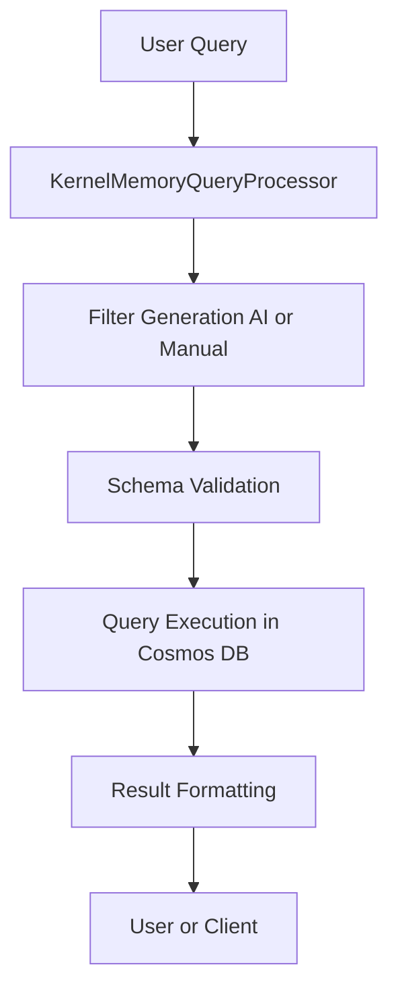

# KernelMemoryQueryProcessor: Query Processing in AI-RAG-Examples-KM

This document provides a detailed overview of the `KernelMemoryQueryProcessor` component, which is responsible for advanced query processing, filter generation, and result formatting in the AI-RAG-Examples-KM application.

---

## Role in the Architecture

`KernelMemoryQueryProcessor` is the main orchestrator for handling user queries against both standard and tabular memory pipelines. It:
- Accepts natural language or structured queries
- Generates structured filters (including AI-driven filter generation)
- Executes queries against the appropriate Cosmos DB index
- Formats and returns results with source attribution

**Integration Points:**
- Consumes `IKernelMemory` and `IMemoryDb` for memory access
- Works with both standard and tabular pipelines
- Integrates with Azure OpenAI for LLM-based filter generation

---

## Key Responsibilities

### Automated Query and Filter Generation

The platform is designed for automation: users can ask natural language questions, and the system dynamically builds the necessary filters and queries behind the scenes. Here’s how the process works:

1. **User Question Intake**
   - The user provides a natural language question (e.g., "Show me all production servers in East US").
   - Optionally, the user can provide explicit filters, but this is not required.

2. **Field Discovery and Schema Awareness**
   - The processor uses `TabularFilterHelper` to discover available fields in the target dataset (from schema and sample data).
   - The schema is validated to ensure only valid fields are used in filters.

3. **AI-Driven Filter Generation**
   - The processor uses an LLM (e.g., Azure OpenAI) to analyze the user’s question and extract the most relevant field(s) and value(s).
   - The LLM is prompted with a list of available fields and asked to return a structured filter in JSON format (field type, field name, value).

4. **Filter Normalization and Validation**
   - The generated filter is normalized (field names to snake_case, data fields prefixed with `data.`).
   - The filter is validated against the schema to prevent invalid queries.

5. **Fuzzy Matching and Logic Application**
   - The processor applies fuzzy matching (LIKE or CONTAINS) and case sensitivity as configured.
   - AND/OR logic is applied: multiple keys = AND, arrays for a key = OR.
   - Explicit LIKE patterns (with `%` or `_`) are detected and used as-is.

6. **Query Construction**
   - The processor dynamically builds the Cosmos DB SQL WHERE clause based on the validated filters, fuzzy match settings, and logic.
   - Tag filters and data field filters are combined as needed.

7. **Query Execution**
   - The query is executed against the Cosmos DB index.
   - Vector similarity search can be combined with structured filters for hybrid search.

8. **Result Formatting and Attribution**
   - Results are formatted for clarity, with answer synthesis (LLM-generated or direct), source attribution (worksheet, row, file), and result limiting as configured.

**All of these steps are automated:** users do not need to know the schema, field names, or filter syntax. The platform handles intent extraction, filter generation, validation, and query construction automatically.

---

### 1. Query Processing

- Accepts user questions (natural language or structured)
- Identifies the relevant dataset (using TabularFilterHelper and LLMs)
- Generates and validates filters based on schema and user intent
- Executes queries using the appropriate filter logic (AND/OR, fuzzy match, etc.)
- Supports result limiting, pagination, and source attribution

### 2. Filter Generation

- **AI-Driven:** Uses LLMs to translate natural language queries into structured filters (JSON format)
- **Manual:** Accepts explicit filters from the user or API
- **Fuzzy Matching:** Supports LIKE and CONTAINS operators, case-insensitive matching, and minimum length configuration
- **AND/OR Logic:** Multiple keys = AND, arrays for a key = OR

### 3. Result Formatting

- Formats results for clarity, including:
  - Answer synthesis (LLM-generated or direct)
  - Source attribution (worksheet, row, file)
  - Limiting displayed sources while using all for answer synthesis

### 4. Advanced Features

- **Schema-Based Validation:** Validates filters against the dataset schema to prevent invalid queries
- **Hybrid Search:** Combines vector similarity (semantic search) with structured field and tag filters
- **Dynamic Prompting:** Adapts LLM prompts based on fuzzy match operator and configuration

---

## Example Usage

**Basic Query:**
```csharp
var queryProcessor = new KernelMemoryQueryProcessor(
    tabularMemory, kernel, "tabular-index", openAIConfig, tabularMemoryDb, "LIKE");

string question = "Show me all production servers in East US";
await queryProcessor.AskTabularQuestionAsync(question, resultLimit: 10);
```

**Structured Filter Query:**
```csharp
var filter = new MemoryFilter();
filter.Add("data.Environment", "Production");
filter.Add("data.Location", "East US");
await queryProcessor.AskTabularQuestionAsync("List all production servers in East US", filter: filter);
```

**AI-Driven Filter Generation:**
- The processor uses TabularFilterHelper and LLMs to extract the most relevant field and value from the user's question, then builds a filter and executes the query.

---

## Data Flow Diagram



---

## Configuration

- Fuzzy match operator, case sensitivity, and minimum length are configured in `appsettings.json` under `FuzzyMatch`.
- Result limiting is controlled via the `resultLimit` parameter.

---

## Best Practices

- Use AI-driven filter generation for flexible, user-friendly queries.
- Always validate filters against the schema to prevent errors.
- Use result limiting to avoid overwhelming users with large result sets.
- Monitor logs for filter generation and query execution diagnostics.

---

## See Also

- [../Readme-Tabular.md](../Readme-Tabular.md) for the full tabular data flow
- [AzureCosmosDbTabular/README.md](../AzureCosmosDbTabular/README.md) for extension details

---

This document is maintained as the authoritative guide for query processing in the application. Update it as new features or patterns are added.
