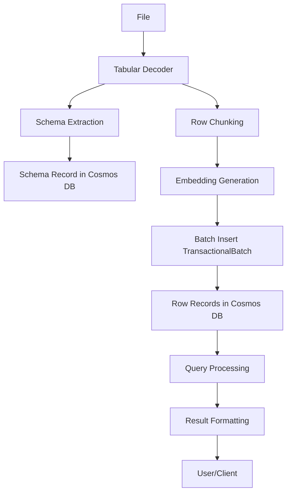

# Tabular Data Handling in AI-RAG-Examples-KM

This document provides a comprehensive guide to how tabular data (Excel, CSV) is ingested, stored, queried, and returned in the AI-RAG-Examples-KM application. It covers the end-to-end data flow, schema and row storage model, query processing, and result formatting, with practical details and best practices.

---

## Why Tabular Data Matters

Tabular data (spreadsheets, CSVs) is common in enterprise knowledge. Preserving its structure—columns, rows, data types, and relationships—is critical for accurate retrieval-augmented generation (RAG) and AI-powered querying. This application is designed to:
- Ingest tabular data while preserving structure and types
- Enable natural language and structured queries over tabular fields
- Return precise, source-attributed results

---

## Data Flow: Ingestion to Query

### 1. Ingestion Pipeline

**Supported Sources:**  
- Excel files (`.xlsx`) via `TabularExcelDecoder`
- CSV files (`.csv`) via `TabularCsvDecoder`
- (Planned: JSON and other structured formats)

**Steps:**
1. **File Selection:** Files are selected from Azure Blob Storage, SharePoint, or local disk.
2. **Decoding:** The appropriate decoder parses the file, extracting:
   - Column headers (normalized)
   - Data types (if enabled)
   - One "chunk" per row, with metadata (worksheet, row number, etc.)
3. **Schema Extraction:**  
   - A schema record is created for each file, describing columns, types, and common values.
   - The schema is stored in Cosmos DB with a `document_type: "schema"` tag.
4. **Row Chunking:**  
   - Each row is converted to a chunk with a unique ID, normalized text, and metadata.
   - The text follows a strict format:  
     `"Record from worksheet {worksheet}, row {row}: schema_id is {sid}. import_batch_id is {bid}. {Column1} is {Value1}. ..."`
5. **Embedding Generation:**  
   - Each chunk's text is embedded using Azure OpenAI.
6. **Batch Ingestion:**  
   - Chunks are grouped by partition key (file name) and inserted into Cosmos DB using TransactionalBatch (batch size configurable, recommended 50).
   - Each row gets a unique ID to prevent overwrites.

### 2. Storage Model in Cosmos DB

**Schema Records:**
- Stored in the same container as row data
- Identified by `document_type: "schema"`
- Contains: schema ID, dataset name, columns, types, common values, import batch ID, file name

**Row Records:**
- Each row is a separate document
- Fields:
  - `id`: Unique per row (Guid-based)
  - `file`: Partition key (file name)
  - `data`: Key-value pairs for each column (normalized)
  - `source`: Metadata (worksheet, row number, etc.)
  - `schema_id`, `import_batch_id`: For grouping and traceability
  - `embedding`: Vector for semantic search
  - `payload`: Original metadata and text

**Partitioning:**
- All rows from the same file share the same partition key for efficient batch operations and queries.

---

## Query Processing

### Filter Generation and Fuzzy Matching

- **Structured Field Queries:** Use the `data.` prefix (e.g., `data.Environment`) to filter on tabular fields.
- **Tag Filters:** Use tag names directly (e.g., `department`).
- **Hybrid Queries:** Combine data fields and tags in the same filter.
- **Fuzzy Matching:**  
  - Configurable via appsettings.json (`FuzzyMatch.Operator`: LIKE or CONTAINS, `CaseInsensitive`, `MinimumLength`)
  - LIKE uses SQL wildcards (`%`, `_`), CONTAINS uses substring matching.
  - Arrays for a key (e.g., `["Production", "Staging"]`) are ORed; multiple keys are ANDed.
  - Explicit LIKE patterns (with `%` or `_`) override the fuzzy match setting.

**Example Filter:**
```csharp
var filter = new MemoryFilter();
filter.Add("data.Environment", "Production");
filter.Add("data.ServerName", "%SVR%"); // LIKE pattern
filter.Add("department", new[] { "IT", "Ops" }); // OR condition
```

### Query Execution

- Filters are processed to generate Cosmos DB SQL WHERE clauses.
- Fuzzy matching, case sensitivity, and AND/OR logic are applied as configured.
- Queries can combine vector similarity (semantic search) with structured filters.

### Result Formatting

- Results include all matching rows, with source attribution (worksheet, row number, file).
- Responses are formatted for clarity, showing both the answer and the supporting sources.

---

## Best Practices and Lessons Learned

- **Unique IDs:** Always assign a unique ID per row to prevent overwrites.
- **Batch Ingestion:** Use TransactionalBatch for high-throughput scenarios. Recommended batch size: 50.
- **Partition Key:** Use file name as partition key for all rows from the same file.
- **Schema and Row Consistency:** Store schema and row records in the same container for easy association.
- **Text Format Consistency:** The "text" field format must match the parser's expectations exactly.
- **Error Handling:** Monitor for 413 (Payload Too Large) errors and adjust batch size as needed.
- **Fuzzy Matching:** Choose LIKE for wildcard patterns, CONTAINS for substring matching. Use case-insensitive matching for user-friendly queries.

---

## Example Workflow

1. **Ingest an Excel file:**
   ```csharp
   var customIngestion = new CustomTabularIngestion(...);
   customIngestion.BatchSize = 50;
   await customIngestion.ImportTabularDocumentCustomAsync("servers.xlsx", "server-inventory");
   ```

2. **Query for all production servers:**
   ```csharp
   var filter = new MemoryFilter();
   filter.Add("data.Environment", "Production");
   var results = await memory.SearchAsync(filter: filter);
   ```

3. **Query for servers with fuzzy name match:**
   ```csharp
   var filter = new MemoryFilter();
   filter.Add("data.ServerName", "%SVR%"); // LIKE pattern
   var results = await memory.SearchAsync(filter: filter);
   ```

4. **Get top values for a field:**
   ```csharp
   var filterHelper = new TabularFilterHelper(memory);
   var topValues = await filterHelper.GetTopFieldValuesAsync("tabular-index", "data", "environment");
   ```

---

## Data Flow Diagram



---

## See Also

- [AzureCosmosDbTabular/README.md](./AzureCosmosDbTabular/README.md) for extension-specific details
- [memory-bank/activeContext.md](./memory-bank/activeContext.md) for current project focus and recent changes
- [memory-bank/progress.md](./memory-bank/progress.md) for project progress and known issues

---

This document is maintained as the authoritative guide for tabular data handling in the root application. Update it as new features, patterns, or lessons are added.
