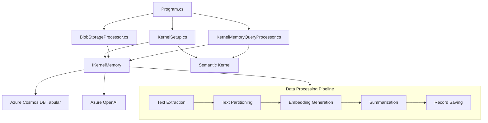

# System Patterns: AI-RAG-Examples-KM

## Architecture Overview

The AI-RAG-Examples-KM project follows a modular architecture centered around Microsoft's Kernel Memory framework, with specialized extensions for tabular data processing. The system is organized into several key components:



## Key Design Patterns

### 1. Dependency Injection
- Configuration is loaded from appsettings.json and injected into components
- Services like IKernelMemory and Kernel are initialized with their dependencies
- This pattern promotes loose coupling and testability

### 2. Pipeline Pattern
- Document processing follows a sequential pipeline of handlers
- Each handler performs a specific task (extraction, partitioning, embedding, etc.)
- Handlers can be added or removed to customize the pipeline

### 3. Repository Pattern
- AzureCosmosDbTabularMemory implements storage operations
- Abstracts the details of data persistence from the business logic
- Provides a consistent interface for memory operations

### 4. Adapter Pattern
- TabularExcelDecoder adapts Excel files to the expected format
- Transforms structured data while preserving relationships
- Implements IContentDecoder interface for consistency

### 5. Strategy Pattern
- Different query strategies can be employed (direct search vs. AI-assisted)
- Filter generation uses AI to translate natural language to structured filters
- Allows for flexible query processing approaches

## Component Relationships

### Core Components

1. **Program.cs**
   - Entry point and orchestration
   - Configures and initializes the system
   - Demonstrates blob processing and querying

2. **KernelSetup.cs**
   - Initializes Semantic Kernel and Kernel Memory
   - Loads configuration from appsettings.json
   - Sets up memory pipeline handlers

3. **BlobStorageProcessor.cs**
   - Processes documents from Azure Blob Storage
   - Downloads and saves files locally
   - Imports documents into Kernel Memory

4. **KernelMemoryQueryProcessor.cs**
   - Handles natural language queries
   - Generates structured filters from queries
   - Formats and presents query results

### Storage Components

*(Note: The source repository `X:\AI\Kernel-Memory-Clone\kernel-memory\extensions` contains both a standard `AzureCosmosDb` vector store extension and the specialized `AzureCosmosDbTabular` extension used in this project.)*

1. **AzureCosmosDbTabularMemory**
   - Implements memory storage using Azure Cosmos DB.
   - Preserves tabular structure in the database within a dedicated `Data` field.
   - Provides specialized query capabilities for structured data, including filtering on nested fields within `Data`.
   - Normalizes query filter keys targeting the `Data` field (e.g., `data.fieldName` becomes `data.field_name`) before executing the query, assuming snake_case keys in the stored data.
   - Stores schema information in the same container as the data, using metadata tags to identify schema documents.

2. **AzureCosmosDbTabularMemoryRecord**
   - Represents a record in the memory database
   - Contains both vector embeddings and structured data
   - Maintains relationships between fields
   - Uses special metadata tags to distinguish between regular records and schema records
   - Implements robust parsing logic (`ParseSentenceFormat`) that extracts worksheet, row, schema ID, import batch ID, and key-value pairs from the `MemoryRecord.Payload["text"]` field
   - Uses a combination of regex for the prefix extraction and manual string splitting/parsing for the data section to ensure reliable data extraction

3. **TabularDataSchema**
   - Represents the schema for a tabular dataset
   - Contains information about columns, data types, and common values
   - Stored in the same container as the data with a "document_type" metadata tag

### Data Processing Components

1. **TabularExcelDecoder**
   - Specialized decoder for Excel files.
   - Preserves tabular structure and data types.
   - Converts worksheets to structured records (one chunk per row).
   - Generates chunk text content in a specific "sentence format" (e.g., "Record from worksheet Sheet1, row 123: schema_id is abc123. import_batch_id is xyz789. Column1 is Value1. Column2 is Value2.") which is parsed by `AzureCosmosDbTabularMemoryRecord` to populate the structured `Data` and `Source` fields in the database record.
   - This specific text format is critical as it's the primary mechanism for transferring structured data through the memory pipeline.

2. **TabularFilterHelper**
   - Assists with generating filters for tabular data
   - Provides methods to get filterable fields and values
   - Helps translate between natural language and structured queries

## Data Flow

1. **Ingestion Flow**
   ```
   Blob Storage → Local Files → Text Extraction → Partitioning → 
   Embedding Generation → Summarization → Cosmos DB Storage
   ```

2. **Query Flow**
   ```
   Natural Language Query → Dataset Identification → Filter Generation → 
   Schema-based Filter Validation → Structured Query → 
   Cosmos DB Retrieval → Result Synthesis → Formatted Response
   ```

## Technical Decisions

1. **Azure Cosmos DB for Storage**
   - Provides flexible schema for different document types
   - Supports efficient vector search for embeddings
   - Allows for structured queries on tabular data

2. **Runtime Dependency Injection**
   - Uses reflection in `Program.cs` (`MemoryHelper`) to inject the `IMemoryDb` instance into `TabularExcelDecoder` at runtime
   - Enables the decoder to save schema information despite being instantiated early in the pipeline
   - Works around limitations in the Kernel Memory framework's pipeline configuration
   - Promotes interface-based design by working with `IMemoryDb` rather than concrete implementations

3. **Custom Excel Processing**
   - Preserves tabular structure during ingestion
   - Maintains data types and relationships
   - Enables more precise querying of structured data

4. **AI-Assisted Filter Generation**
   - Translates natural language to structured filters
   - Improves precision of queries against tabular data
   - Reduces need for exact field name knowledge

5. **Vector Search Optimization**
   - Uses the correct serialized JSON property name (vector) in SQL queries despite the constant naming (embedding)
   - Omits sorting directives (ASC/DESC) from VectorDistance function calls in Cosmos DB queries
   - Supports unlimited query results by conditionally including TOP @limit in SQL
   - Provides comprehensive error messages for vector search failures with troubleshooting guidance
   - Uses field paths compatible with Cosmos DB's Vector Index requirements

6. **Robust Memory DB Access**
   - Enhanced `TabularFilterHelper` with multi-level fallback strategies for accessing the memory DB
   - Implemented progressive reflection to find the memory DB in multiple possible locations
   - Added index name parameter to `TabularFilterHelper` constructor for improved context
   - Updated log messages to provide detailed diagnostic information during memory DB access
   - Ensured consistent usage of the memory DB access pattern across the application

6. **Modular Pipeline Architecture**
   - Allows for customization of processing steps
   - Enables extension to new document types
   - Provides clear separation of concerns
